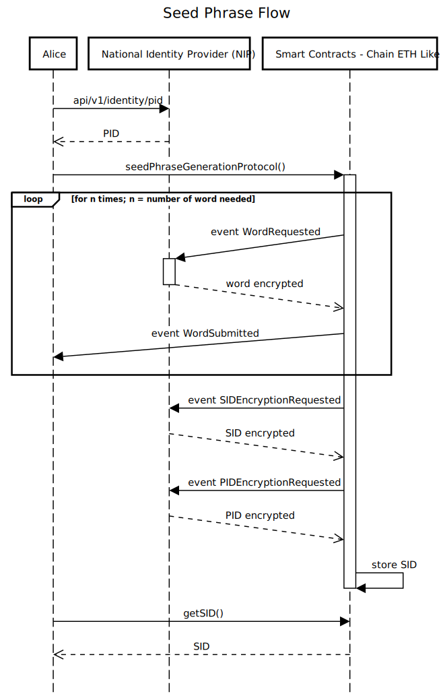
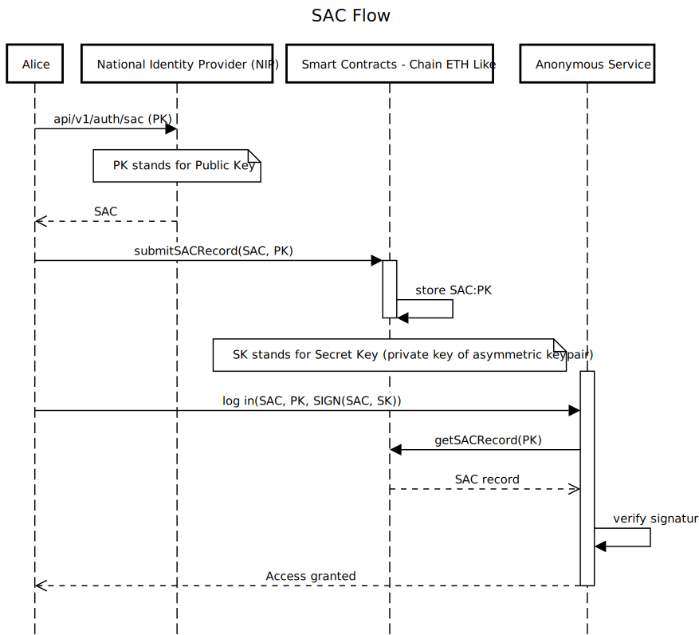
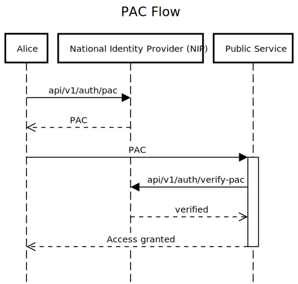

[](https://go.dev/doc/go1.24)


NIP (National Identity Provider) server

## Run with Docker

Build the `nip-backend` image

```bash
docker build . -t nip-backend
```

Run it with

```bash
docker compose up
```

or

```bash
task up
```

## Scale Instances

Currently `docker-compose.yaml` runs 6 instances of `nip-backend` with a shared PostgreSQL databse. To increase the number of instances either switch to [swarm mode](https://docs.docker.com/engine/swarm/) or manually add a `env.instanceN` file and a new `nip-backend` entry in `docker-compose.yaml`.

```yaml
nip-backend-{n}:
  image: nip-backend:latest
  container_name: nip-backend-{n}
  networks:
    - nip-net
  ports:
    - "{port}:8888"
  env_file:
    - .env.instance{n}
```

## Sequence Diagrams

[Edit this diagram](https://sequencediagram.org/index.html#initialData=C4S2BsFMAIEF4FAIA4EMBOoDGI0Dtg5wQtIUNtdUDoAiAOVVAHs9VxoBJAE0gLACe0AArpmANxC900ABT1OwgJS1oqAM7QFw8phJUatAMoBbCtADCrYOlRZgmgLSWAFqhB5oAUQAqACWgAGRAAa0hVDWhTcysCW3t1JFhiUkcAPm0ALlRkEAB6cQBGPKk+UGABPNzuBGSSSAAeBsdHLOFOABFalMh06MxLa3iHTPVISG5hF1sxgHE+SFsWPFFmYGYsZnBZJWgEO1BxJhh+wlibA8TwZmZkaAAzZhlPUBNIdQBuaE8AXm+AVxMACNFtBmPdoAB3J7cb7jXg1U6DOKXdKyABMSiykHEZWgAHUYQAlSAAR3+72AE329hARypWkUCG0LTSaQxSiR52G6ky0PQsL4WHQAmQVJqvAOdOOjJ0XKGqPZmLqpEyOLxhIFRn+QJMYHFCD4iLMA25iuxuJoRk6XjwwtFyxJ5Mp1JZ6SVnJNZwVCUy1o60CFIrF1PlKIS6QtePaHVt9rFIFYTop6gNbrZHLDF19McDduDBqzPL6XuR2ZGqaeJ06CEltPpJ1LZoSSR6JZiPpGAHNIMB-TsEEXUe6VZA-Z0gA)



[Edit this diagram](https://sequencediagram.org/index.html#initialData=C4S2BsFMAIGUEEDC0Bi4D2B3AUNgDgIYBOoAxiIQHbDTzgimT7FkUHXQBEAcgaOpQLhoASQAmkamACe0AApF0ANxASi0ABTcRcgJSdoBAM7Rtc5iQZsOnWAFsW0RAOBECpYCYC0TgBYEQSmgAUQAVAAloABkQAGtIA2M4BxInFzcPIwtWKhpOeEoBaTt0AFcTWEgiFUZEkwKikvK4KpqmbDoGSC8APjMALgI8EAB6JQBGEYJS4F8Ro3dNOQBpXWxC4BhlKtMdfpXoI2B2MRMAM3R1OVKAI3pSaGXIaQ77yAAed68vAYREV66vXsjmc1Aynn6RludjAfwASpBSJcxBo-gAaeSrbDuUBKPgwYGpUGuHFZQk0YngoxAlIU9KkyHAS4EpD7ZbYCQ4kB4zbJEH0zLrdC87bqclpMEM2DLQ7HSinaAXMWIoiQGhPWQaPBEbn46DxWToM6GIzFOxqnUPA2EEBENZcnkwBqUYplCqtLoAxi9Z2u5qVapdfoYADm0ECqKQGJWGNgIgA4txI4hY6s1r6mu7A96euLKQyQ2r4YjkRoVms8wLPN8ej0M26WtnIP0-tBVUiiGIOoUXZnG20fT2-Vm2v0lFUQGdZEYQCHBMBSqru40GwGB70629+vBSIwjCYQ25qJAxNAOZAHXr6-6PYxsEA)



[Edit this diagram](https://sequencediagram.org/index.html#initialData=C4S2BsFMAIAUEEDC0Bi4D2B3AUNgDgIYBOoAxiIQHbDTzgimT7FkUHXQBEAcgaOpQLhoASQAmkamACecIugBuICUWgAKbiNgBKTtAIBnaJtjMSDNh06wArgCN6paAGVIRJYz2G49xy7ceTNh0DJAAtAB8JgBcBHggAPQKAIwJBDbAABYJhKTYJmGRESGM0QiIwY7hEbYODP7uodFwSNgEpKAKfDC1fq6NjNi99f2BkTFxiSlpGdkKbiAAZtJhuflahRE1viMBTfNESyCQYkM7TqOhm8VVzfCkjAZGAOZE7MAn2BLtnd0+dRc9owgA)


